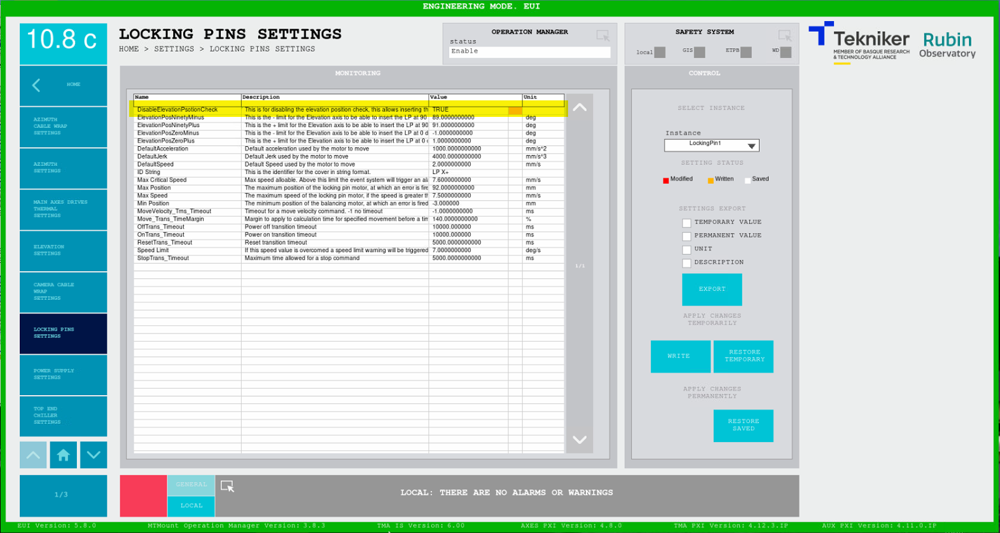

<!-- This page was reviewed and edited by Jacqueline Seron
Between the text I added the descriptions of changes I propose 
Changed title
# Locking Pins Without Home
-->

# Insert Locking pins without homing

| **Requested by:** | **AURA** |
|-------------------|----------|
| **Doc. Code**     | #{documentCode}       |
| **Editor:**       | A. Izpizua         |
| **Approved by:**  | J. Garcia         |

## Index

- [Locking Pins Without Home](#locking-pins-without-home)
  - [Index](#index)
  - [Introduction](#introduction)
  - [Precondition](#precondition)
  - [Procedure](#procedure)
    - [Disabling/Enabling Locking pins Elevation check](#disabling-and-enabling-locking-pins-elevation-check)

## Introduction
<!-- old version
The locking pins in test position are used to perform the fine balancing. In this case just put the locking pins in test
and continue with the balancing procedure.

In a coarse balancing done with the motors, if a home is not possible or recommend, locking pins are not able to insert again
from free position to any other position. This document shows how to proceed in this case
new version below, reviewed by David Jimenez
-->

For fine balancing, the elevation locking pins are free, allowing the TMA elevation axis to move through its range, while for coarse balancing, the locking pins are in the TEST position and is performed with the motors.

If homing is not possible or not recommended, the locking pins cannot be reinserted from the free position into any other position. This document describes how to proceed in that situation.

When homing is not done the Elevation position is not accurate because it’s taken from the inclinometer. The strategy is to take note of the position as soon as the Elevation drives power ON, although it lacks accuracy, it is precise (repeatable in time). If the Elevation drives are powered OFF measurements remain consistent.

<!-- new section --> 

## Precondition

* Elevation locking pins in FREE position.

* An engineering task requires to insert the Elevation locking pins without homing.

* Be authorized to perform this procedure.

<!-- original text
## Move elevation

Move elevation to desired position, 0 or 90. Take into account that this position is not precise since the inclinometer
is used to initialize the position. In this case the best solution is to take note of the position when the axis starts
because the telescope is not precise in the actual position, but it is very repetitive, if the telescope is not switched off.
Even if the telescope is switched off, the repeatability of the inclinometer is by far better than its precision,
so the telescope position is more repetitive than precise without homing.

So, the procedure should be

- Start elevation
- Take note of the current position
- Move elevation
- Get back to the same locking pin position using the noted down position
- Switch off elevation
- Insert locking pins (see [Locking pins](#locking-pins) for mor info on how to enable)

Below the new version I've separated the steps and enumerate. 
The pertinent information is now in the introduction
-->

## Procedure

To insert locking pins without homing:

1. Power ON the Elevation drives.
2. Take note of the Elevation position.
3. Move Elevation axis to 0 degrees or 90 degrees.
4. Move to the noted position of step 2.
5. Power OFF the Elevation drives.
6. Insert locking pins by overriding its settings, refer to [the section below](#disabling-and-enabling-locking-pins-elevation-check).

<!-- original text
## Locking pins

To enable the ability to insert the locking pins in any position there is a setting, "DisableElevationPositionCheck".
This settings in true makes that the locking pins does not check the elevation position, so it could be inserted in any position.
**Be careful using this setting, because the locking pin could be damaged if the hole in the telescope is not aligned with
the locking pin when the locking pin is inserted**.

New version has a title, and separated between context information and steps 
-->

### Disabling and Enabling Locking pins Elevation check

The <code>DisableElevationPositionCheck</code> set to **TRUE** allows operating the locking pins without checking the TMA elevation.

> [!WARNING]
> This setting must only be changed by authorized, trained personnel and with extreme caution. If the telescope is not properly aligned with the locking pin position before insertion, the pin may be damaged.

1. Go to Home > Settings > Locking Pin Settings
2. Click on <code>DisableElevationPositionCheck</code> and change the value to **TRUE**
3. After the procedure is done, set <code>DisableElevationPositionCheck</code> to **FALSE**

> ❗ **This setting should always be *False* if it is not necessary** ❗ 

