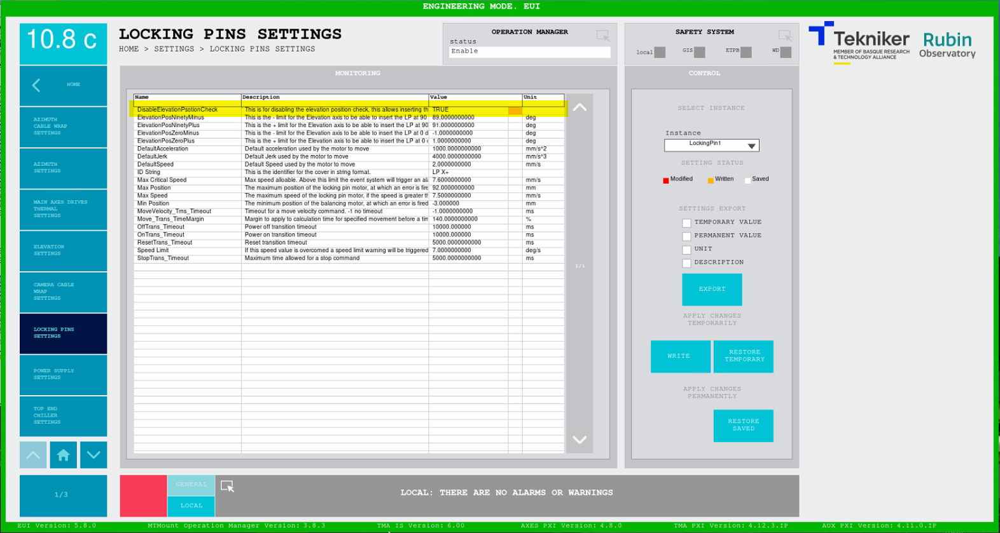

# Locking Pins Without Home

| **Requested by:** | **AURA** |
|-------------------|----------|
| **Doc. Code**     | #{documentCode}       |
| **Editor:**       | A. Izpizua         |
| **Approved by:**  | J. Garcia         |

## Index

- [Locking Pins Without Home](#locking-pins-without-home)
  - [Index](#index)
  - [Introduction](#introduction)
  - [Move elevation](#move-elevation)
  - [Locking pins](#locking-pins)

## Introduction

The locking pins in test position are used to perform the fine balancing. In this case just put the locking pins in test
and continue with the balancing procedure.

In a coarse balancing done with the motors, if a home is not possible or recommend, locking pins are not able to insert again
from free position to any other position. This document shows how to proceed in this case

## Move elevation

Move elevation to desired position, 0 or 90. Take into account that this position is not precise since the inclinometer
is used to initialize the position. In this case the best solution is to take note of the position when the axis starts
because the telescope is not precise in the actual position, but it is very repetitive, if the telescope is not switched off.
Even if the telescope is switched off, the repeatability of the inclinometer is by far better than its precision,
so the telescope position is more repetitive than precise without homing.

So, the procedure should be

- Start elevation
- Take note of the current position
- Move elevation
- Get back to the same locking pin position using the noted down position
- Switch off elevation
- Insert locking pins (see [Locking pins](#locking-pins) for mor info on how to enable)

## Locking pins

To enable the ability to insert the locking pins in any position there is a setting, "DisableElevationPositionCheck".
This settings in true makes that the locking pins does not check the elevation position, so it could be inserted in any position.
**Be careful using this setting, because the locking pin could be damaged if the hole in the telescope is not aligned with
the locking pin when the locking pin is inserted**.

> ❗ **This setting should always be *False* if it is not necessary** ❗
